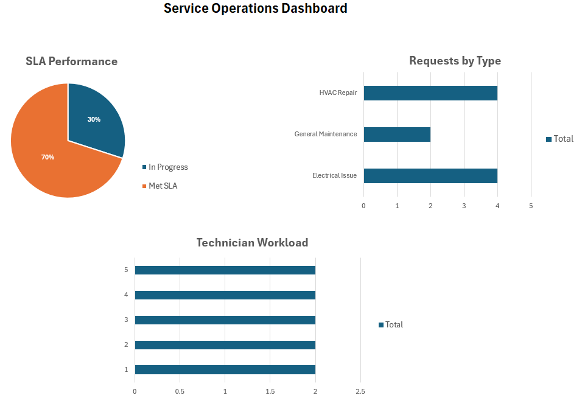

# Service Operations Dashboard

## Key Insights
- 70% of requests met SLA, while 30% remain in progress, indicating moderate operational efficiency
- Electrical issues represent the highest request volume, suggesting a potential bottleneck
- Technician workload is evenly distributed, with no single technician overloaded

## Overview
This project analyzes service request data to evaluate operational performance, SLA compliance, and technician workload.

The dashboard was built in Excel using pivot tables, calculated fields, and data visualization techniques to simulate real-world operations reporting.

## Objectives
- Track SLA compliance (Met vs In Progress)
- Identify request volume by service type
- Analyze workload distribution across technicians

## Tools Used
- Excel (Pivot Tables, Charts, Formulas)
- Data Cleaning Techniques
- Basic SLA Logic (IF statements)

## Key Insights
- Majority of requests met SLA targets
- Electrical and HVAC issues represent the highest request volume
- Technician workload is evenly distributed across the team

## Files
- `dashboard.png` — dashboard preview image
- `service_requests.xlsx` — dataset, pivot tables, and dashboard

## Skills Demonstrated
- Data cleaning and structuring
- Data analysis using Excel
- Business-focused reporting
- Dashboard design and visualization
